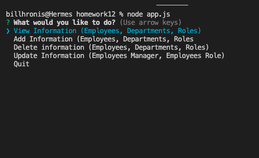
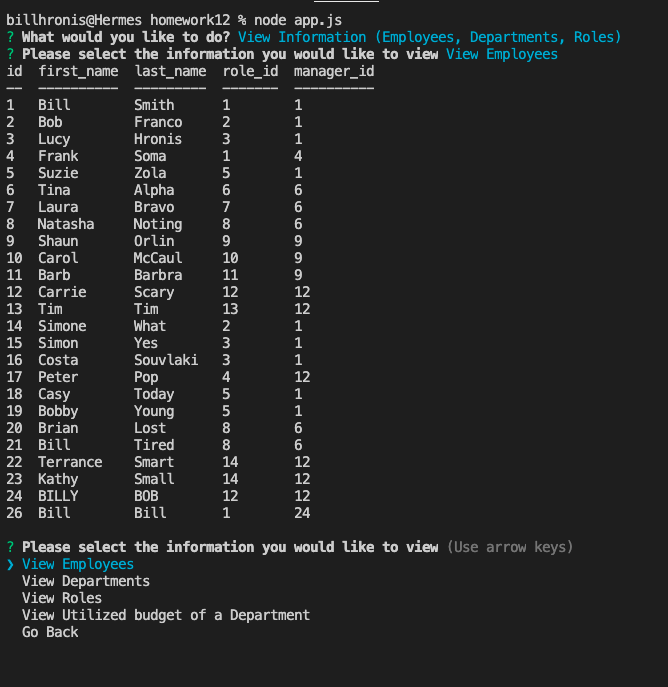
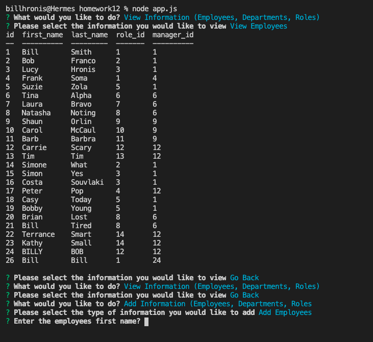
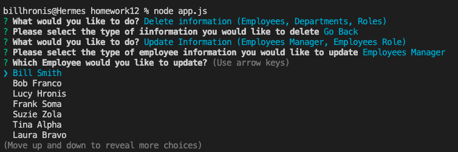
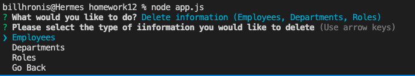

# Employee Tracker Application 
  

## Table of Contents 
- [Employee Tracker Application](#employee-tracker-application)
  - [Table of Contents](#table-of-contents)
  - [Description](#description)
  - [Installation Instructions](#installation-instructions)
  - [Usage](#usage)
  - [Licensing](#licensing)
  - [Contributing](#contributing)
  - [Tests Code](#tests-code)
  - [Pictures and Video](#pictures-and-video)
      - [Link to Video Walkthrough](#link-to-video-walkthrough)
      - [GitHub Team Profile Generator Repo:  https://github.com/daze77/employeeTracker](#github-team-profile-generator-repo--httpsgithubcomdaze77employeetracker)
  - [Questions](#questions)
    
## Description
    The application was designed for a quick and easy way to manage an organizations employees, their roles and departments.  The applicaton runs in the terminal and allows the user to view, add and delete, employeees, roles and departments.  In additon, the application allows a user to update an employees role and manager while providing the option to view the budget utilization by department selected.
    
## Installation Instructions 
    There are no specific instructions for installation.  As this application is run in the terminal, the entire package must be downlaoded then run with the node index.js command in the root folder of the application to launch.

## Usage
    Use this application to easily manage employees of an organization with very little overhead.  You must be connected to a mySQL database to be able to add and retrieve information though as we store information in mySQL.
    
## Licensing
      

    
## Contributing
    Open for contributions and improvements
    
## Tests Code
    To test the applictoin, download the folder of files, connect to mySQL database, udpate the database folder and password and begin to add and manipulate data entered.

## Pictures and Video
Please find screenshots and a brief video showcasing the application below

#### Link to Video Walkthrough

[link to walkthrough](Assets/images/etWalkthough.mp4)

#### GitHub Team Profile Generator Repo:  https://github.com/daze77/employeeTracker

## Questions
    
You can find me here on [GitHub](http://github.com/daze77), or contact me via [email](mailto:daze77@gmail.com)  
    